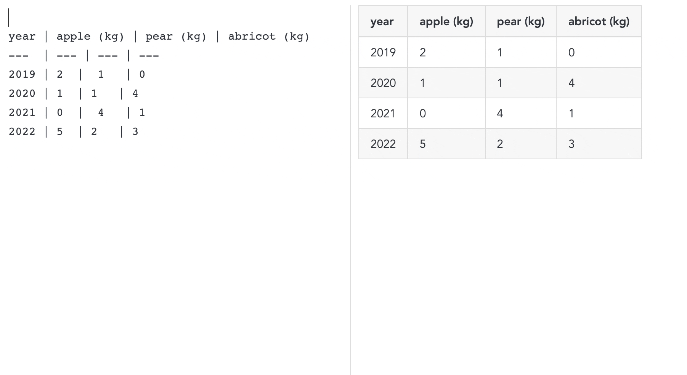

# :memo::curly_loop::bar_chart: Transforms tables to charts

The goal of this Joplin plugin is to render a chart based on a markdown table with minimum configuration.




# How to install

- Download the last release from this repository.
- Open `Joplin > Options > Plugins > Install from File`
- Select the jpl file you downloaded.

# How to use

- In your markdown page, create a table which respects this contraints:
  - Have at least 2 columns
  - All columns except the first one are numbers.
- Wrap your table with ` ```turnToChart` and ` ``` `

## Type of the x-axis
`turnToChart` plugin supports 3 types of data:
- `number`: numerical value as a continuous range
- `date`: date value as a continuous range
- `category`: string value as a discrete range

By default, the plugin tries to guess the type but you can force it by providing it in square bracket `[]` in the first cell of the table.

*Example where we enforce a `date` type:*
```
year [date] | apple | pear
----------- | ----- | -----
2019        | 2     | 3
2020        | 4     | 6
```

## Axis and their positions relative to 0
By default, the plugin defines the domain of the x-axis and the y-axis based on the minimum and maximum of the data available.

If you wish to force an axis to start at 0, add `:` in the horizontal delimiters. If you add `:` on the first column, the x-axis will start at 0. If you add `:` on any other column, the y-axis will start at 0.

*Note:* This rule is ignored for `date` and `category` type axis.

*Example where we force the x-axis humidity to start at 0:*
```
humidity    | apple (kg) | pear (kg)
:---------- | ---------- | -----
20          | 2          | 3
25          | 4          | 6
```

*Example where we force the y-axis kg to start at 0:*
```
humidity    | apple (kg) | pear (kg)
----------- | :--------- | :-----
20          | 2          | 3
25          | 4          | 6
```

## Units
The unit for the x-axis is the full string of the first cell of the header.
The units for the y-axis are the string in parentheses `()` of each subsequent cells of the header.

# Development
If you want to contribute to this plugin you can find here some userful references:

- [Joplin - Getting started with plugin development](https://joplinapp.org/api/get_started/plugins/)
- [Joplin - Plugin API reference](https://joplinapp.org/api/references/plugin_api/classes/joplin.html)
- [Joplin - Data API reference](https://joplinapp.org/api/references/rest_api/)
- [Joplin - Plugin examples](https://github.com/laurent22/joplin/tree/dev/packages/app-cli/tests/support/plugins)
