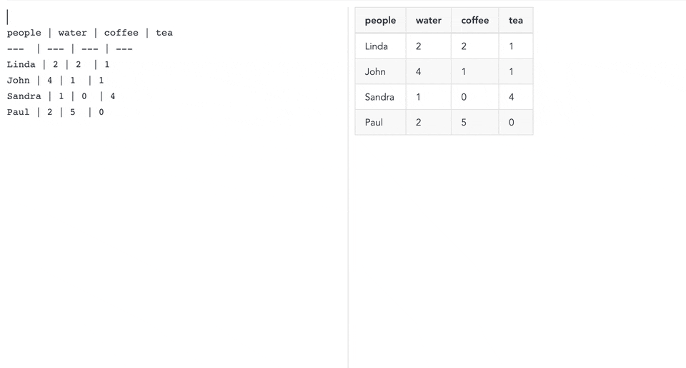
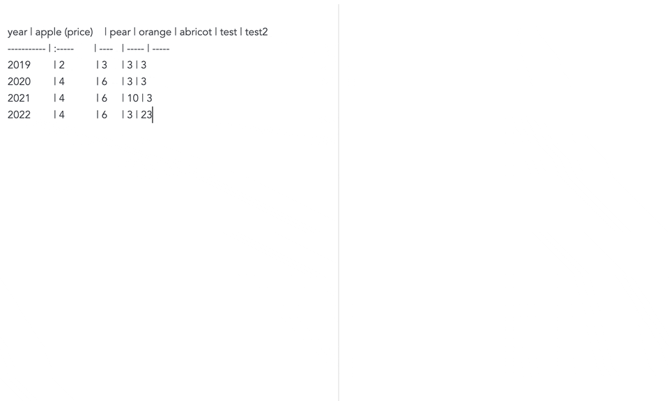
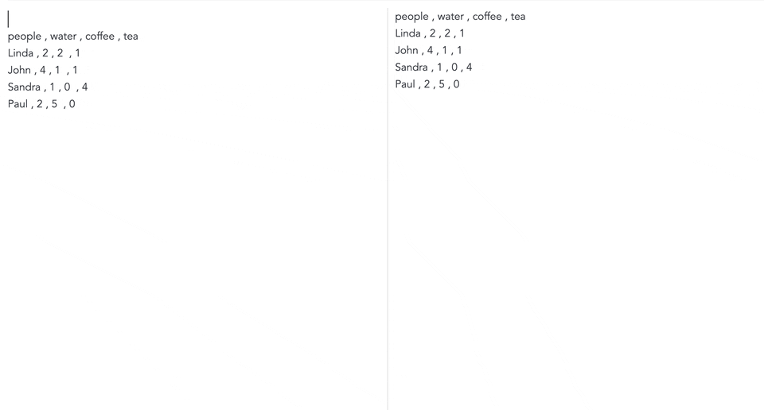

# :memo::curly_loop::bar_chart: Transforms tables to charts

The goal of this Joplin plugin is to render an HTML chart based on a `markdown` or `csv` with minimum configuration.







# How to install

- Download the last release from this repository.
- Open `Joplin > Options > Plugins > Install from File`
- Select the jpl file you downloaded.

# How to use

- In your markdown page, create a `markdown` or `csv` table which respects this contraints:
  - Have at least 2 columns
  - All columns except the first one are numbers.
- Wrap your table with ` ```turnToChart` and ` ``` `
- Add options after the table

*Example of a markdown table with extra options:*
~~~
```turnToChart
year        | apple | pear
----------- | ----- | -----
2019        | 2     | 3
2020        | 4     | 6
2021        | 3     | 8


xAxisType: date
xAxisNbOfTicks: 4
yAxisFormat: ($.0f
yAxisNbOfTicks: 4
yAxisOrigin: from zero
```
~~~

*Example of a csv table with extra options:*
~~~
```turnToChart
year        , apple , pear
2019        , 2     , 3
2020        , 4     , 6
2021        , 3     , 8


xAxisType: date
xAxisNbOfTicks: 4
yAxisFormat: ($.0f
yAxisNbOfTicks: 4
yAxisOrigin: from zero
```
~~~

## Available options

You have the possiblity to modify the chart by adding options after the table. There should be one option per line and it should follow the following syntax:  `optionKey: value of this option`.

### customLocale
| optionKey      | possible values                     | behavior when no value         |
| ---            | ---                                 | ---                            |
| customLocale   | see the list below                  | consider `en-GB` by default    |

Translate in this locale the date on the xAxis when xAxisType=`date`.

Here is the list of locale available:
- `ar-EG`: Arabic (Egypt)
- `ca-ES`: Catalan (Spain)
- `cs-CZ`: Czech (Czech Republic)
- `da-DK`: Danish (Denmark)
- `de-CH`: German (Switzerland)
- `de-DE`: German (Germany)
- `en-CA`: English (Canada)
- `en-GB`: English (United Kingdom)
- `en-US`: English (United States)
- `es-ES`: Spanish (Spain)
- `es-MX`: Spanish (Mexico)
- `fa-IR`: Persian (Iran)
- `fi-FI`: Finnish (Finland)
- `fr-CA`: French (Canada)
- `fr-FR`: French (France)
- `he-IL`: Hebrew (Israel)
- `hr-HR`: Croatian (Croatia)
- `hu-HU`: Hungarian (Hungary)
- `it-IT`: Italian (Italy)
- `ja-JP`: Japanese (Japan)
- `ko-KR`: Korean (South Korea)
- `mk-MK`: Macedonian (Macedonia)
- `nb-NO`: Norwegian Bokmål (Norway)
- `nl-NL`: Dutch (Netherlands)
- `pl-PL`: Polish (Poland)
- `pt-BR`: Portuguese (Brazil)
- `ru-RU`: Russian (Russia)
- `sv-SE`: Swedish (Sweden)
- `tr-TR`: Turkish (Turkey)
- `uk-UA`: Ukrainian (Ukraine)
- `zh-CN`: Chinese (China)
- `zh-TW`: Chinese (Taiwan)

*Example where we enforce Hungarian language:*
~~~
```turnToChart
year        | apple | pear
----------- | ----- | -----
2019        | 2     | 3
2020        | 4     | 6

xAxisType: date
customLocale: hu-HU
```
~~~

### legendOrientation
| optionKey          | possible values              | behavior when no value   |
| ---                | ---                          | ---                      |
| legendOrientation  | `vertical` or `horizontal`   | `horizontal`             |

### legendTitle
| optionKey          | possible values              | behavior when no value   |
| ---                | ---                          | ---                      |
| legendTitle        | any string value             | No title                 |

### xAxisType
| optionKey      | possible values                     | behavior when no value   |
| ---            | ---                                 | ---                      |
| xAxisType      | `number` or `date` or  `category`   | autodetected             |

It supports 3 types of data:
- `number`: numerical value as a continuous range
- `date`: date value as a continuous range
- `category`: string value as a discrete range

*Example where we enforce a `date` type with the normal syntax:*
~~~
```turnToChart
year        | apple | pear
----------- | ----- | -----
2019        | 2     | 3
2020        | 4     | 6

xAxisType: date
```
~~~


Note that you can also pass this option by providing it in square bracket `[]` in the first cell of the table.
*Example where we enforce a `date` type with the square bracket `[]` syntax:*
~~~
```turnToChart
year [date] | apple | pear
----------- | ----- | -----
2019        | 2     | 3
2020        | 4     | 6
```
~~~

### xAxisFormat
| optionKey      | possible values                     | behavior when no value   |
| ---            | ---                                 | ---                      |
| xAxisFormat    | see [d3-format](https://github.com/d3/d3-format) for `number` xAxisType and [d3-time-format](https://github.com/d3/d3-time-format) for `date` xAxisType   | none     |

### yAxisFormat
(see xAxisFormat)

### xAxisNbOfTicks
| optionKey      | possible values               | behavior when no value   |
| ---            | ---                           | ---                      |
| xAxisNbOfTicks | should be a positive number   | autodetected             |

### yAxisNbOfTicks
(see xAxisNbOfTicks)

### xAxisOrigin
| optionKey      | possible values                        | behavior when no value       |
| ---            | ---                                    | ---                          |
| xAxisOrigin    | `from zero` or `from data boundaries`  | Use `from data boundaries`   |

*Note:* This rule is ignored for `date` and `category` type x-axis.

### yAxisOrigin
| optionKey      | possible values                        | behavior when no value       |
| ---            | ---                                    | ---                          |
| yAxisOrigin    | `from zero` or `from data boundaries`  | Use `from data boundaries`   |

## Units
The unit for the x-axis is the full string of the first cell of the header.
The units for the y-axis are the string in parentheses `()` of each subsequent cells of the header.

## Comments
Any string surrounded by `<!--` and `-->` will be ignored by the plugin.

*Example of a table with comments:*
~~~
```turnToChart
year  <!--this is a comment -->      | apple | pear
-----------------------------------  | ----- | -----
2019                                 | 2     | 3 <!-- another comment --> 
2020                                 | 4     | 6
```
~~~

## Formulas
turnToChart is compatible with [Markdown table calculations](https://github.com/oswida/joplin-markdown-calc) plugin. Install it to be able to add formulas in your table.

*Example of a table with formulas:*
~~~
```turnToChart
| xAxis   | linear         |    square       |
|---------|---------       |---------------- |
| 0       |<!--FM 2*A1--> 0|<!--FM A1*A1--> 0|
| 1       |<!--FM 2*A2--> 2|<!--FM A2*A2--> 1|
| 2       |<!--FM 2*A3--> 4|<!--FM A3*A3--> 4|
| 3       |<!--FM 2*A4--> 6|<!--FM A4*A4--> 9|
```
~~~

# Development
If you want to contribute to this plugin you can find here some userful references:

- [Joplin - Getting started with plugin development](https://joplinapp.org/api/get_started/plugins/)
- [Joplin - Plugin API reference](https://joplinapp.org/api/references/plugin_api/classes/joplin.html)
- [Joplin - Data API reference](https://joplinapp.org/api/references/rest_api/)
- [Joplin - Plugin examples](https://github.com/laurent22/joplin/tree/dev/packages/app-cli/tests/support/plugins)


## Building the plugin

The plugin is built using Webpack, which creates the compiled code in `/dist`. A JPL archive will also be created at the root, which can use to distribute the plugin.

To build the plugin, simply run `npm run dist`.

The project is setup to use TypeScript, although you can change the configuration to use plain JavaScript.

## Updating the plugin framework

To update the plugin framework, run `npm run update`.

In general this command tries to do the right thing - in particular it's going to merge the changes in package.json and .gitignore instead of overwriting. It will also leave "/src" as well as README.md untouched.

The file that may cause problem is "webpack.config.js" because it's going to be overwritten. For that reason, if you want to change it, consider creating a separate JavaScript file and include it in webpack.config.js. That way, when you update, you only have to restore the line that include your file.
